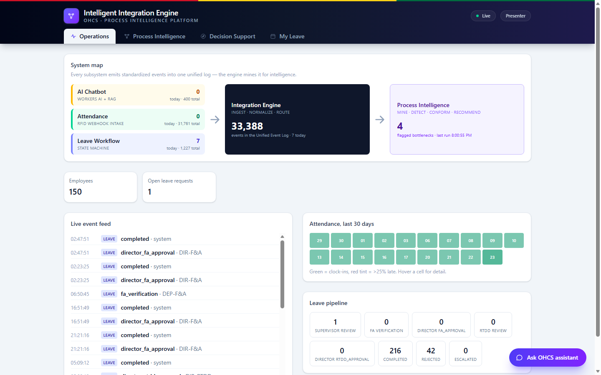
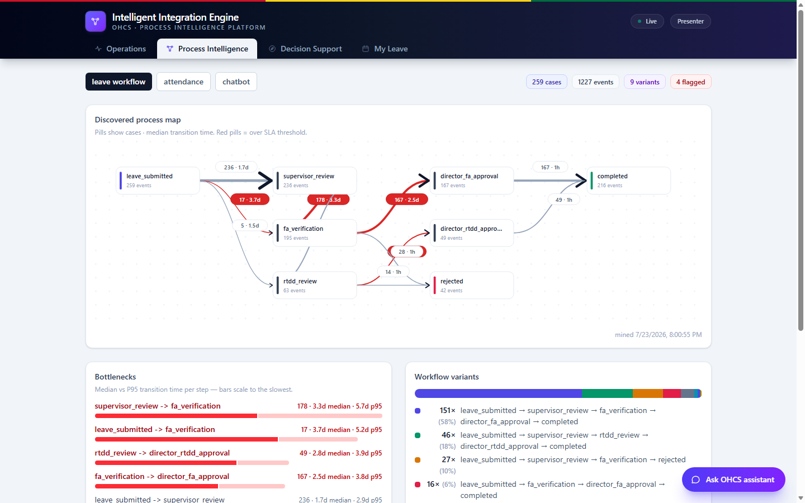
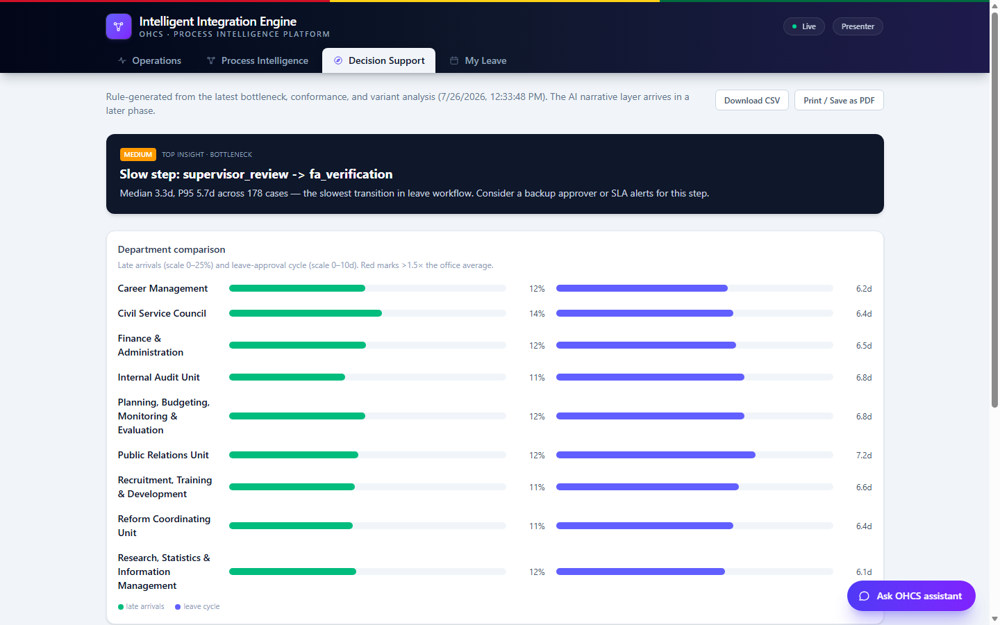

# IIE — Intelligent Integration Engine

> Process intelligence for the Office of the Head of Civil Service (OHCS), Ghana.
> One unified event log from every subsystem — RFID attendance, the leave
> workflow, and an HR chatbot — mined automatically into the real process map,
> bottlenecks, conformance findings, and management-ready recommendations.

[](https://iie.ohcsghana.org)
[](https://workers.cloudflare.com/)
[](#testing--validation)

**[Open the live demo →](https://iie.ohcsghana.org)** — passwordless sign-in with 6-digit OTP. 11 test accounts cover every RBAC role from Employee to System Admin, seeded with 6 months of simulated OHCS operations (150 staff across the 9 real OHCS units, ~33,300 events). Explore the four views — Operations, Process Intelligence, Decision Support, and My Leave — plus the floating AI assistant.



## What is this?

Most dashboards show you numbers you asked for. IIE discovers how work
*actually* flows from the event log and tells you where reality deviates from
policy — without anyone configuring it:

- The process map below was **mined, not drawn** — it discovered both real
  OHCS leave chains (standard leave via F&A, study leave via RTDD) from raw
  events alone.
- It flags the slowest hand-off (supervisor → F&A verification, median 3.3
  days) and catches every case that bypassed supervisor review (22/22, zero
  false positives) — validated against planted ground truth.



## Highlights

- **Unified canonical event log** — every subsystem emits one event schema; new systems just start emitting.
- **Process discovery** — directly-follows graph mining with variants, per source system.
- **Bottleneck detection** — median/P95 transition times vs per-source SLA thresholds (KV-tunable, no redeploy).
- **Conformance checking** — every leave case audited against the prescribed chain for its type.
- **Decision support** — severity-ranked, plain-English recommendations + department comparison, exportable to CSV/PDF.
- **Self-service leave** — submit/track/approve through the real OHCS chains; the state machine enforces role *and* directorate.
- **AI assistant** — RAG over the actual policy documents (Vectorize + Llama 3.3 70B), personal-data queries answered deterministically with no LLM, and it executes real leave transactions.
- **Live everything** — server-sent event feed, polling stat cards, 6-hourly cron mining.



## Architecture

One Cloudflare Worker (Hono) + D1 + Workers AI + Vectorize + R2 + KV, with the
React SPA served as static assets. Requirements: [`IIE_PRD.pdf`](IIE_PRD.pdf).
One Worker, modular routes — split into separate Workers only if a module
outgrows it.



## Documentation

| Document | What it is |
|---|---|
| [`IIE_PRD.pdf`](IIE_PRD.pdf) | Product requirements (source of truth) |
| [`IIE_TECHNICAL_REPORT.md`](IIE_TECHNICAL_REPORT.md) · [`IIE_Technical_Report.pdf`](IIE_Technical_Report.pdf) | Thesis companion — design decisions, references |
| [`iie_cloudflare_architecture.svg`](iie_cloudflare_architecture.svg) | Architecture diagram |
| [`AGENTS.md`](AGENTS.md) | Project memory: domain model, invariants, commands |

## Layout

- `src/index.ts` — Worker entrypoint (Hono) + cron `scheduled` handler (mining 6-hourly, daily checks 18:43 UTC).
- `src/lib/events.ts` — canonical event schema (zod) + D1 insert helpers.
- `src/lib/workflow.ts` — leave approval state machine (steps, roles, transitions).
- `src/lib/leave-actions.ts` — leave-request creation shared by REST route + chatbot.
- `src/lib/rag.ts` — policy doc chunking, Workers AI embeddings, Vectorize retrieval.
- `src/lib/recommendations.ts` — rule-based decision-support generator (PRD §6.4).
- `src/mining/` — process intelligence: DFG builder, bottleneck stats, conformance checker, job orchestrator.
- `src/jobs/daily.ts` — missing clock-out anomalies + 48h leave-step escalations.
- `src/routes/` — `intelligence`, `attendance`, `leave`, `org`, `chatbot`, `stats` sub-apps.
- `web/` — dashboard SPA (Vite + React + Tailwind), served as Workers static assets.
- `migrations/` — D1 schema (events log, org tables, analysis tables).
- `scripts/seed.mjs` — imports org directory + HR policy corpus, then generates synthetic events.

## Develop

```sh
npm install && npm --prefix web install
npm run db:migrate:local   # create + migrate local D1
npm run build:web          # build the dashboard into web/dist (required once)
npm run dev                # http://localhost:8787 — API + dashboard together
npm run seed -- --employees 10 --months 1   # smoke-test dataset
npm run seed               # full dataset: 150 staff (122 officers + management), 6 months
npm test                   # vitest suite (runs inside the Workers runtime)
npm run validate           # PRD §13 metrics report (needs dev server + seed)
npm run check              # typecheck
```

The seed is additive: case ids are namespaced by `--seed`, so different seeds
coexist, but re-running with the same seed duplicates events. To start over,
wipe every table and re-seed in one step:

```sh
npm run seed -- --reset
```

For frontend iteration with hot reload: keep `npm run dev` running and also run
`npm --prefix web run dev` (Vite proxies /api to the Worker on :8787).

Regenerate `worker-configuration.d.ts` after changing bindings: `npm run types`.
Crons: mining every 6h, daily checks 18:43 UTC (Accra = UTC). Trigger mining on
demand with `POST /api/intelligence/run`; test either cron path via
`wrangler dev --test-scheduled` +
`curl "http://localhost:8787/__scheduled?cron=43 18 * * *"`.

Note: Workers AI and Vectorize have no local simulation — they always hit the
real services (`remote: true` in `wrangler.jsonc`), even under `wrangler dev`.
AI usage is billed against the free tier (10k neurons/day).

## Runtime config (KV)

The `CONFIG` KV namespace holds tunables, read at mining time with code
defaults as fallback. Currently: `bottleneck_thresholds_ms` — per-source median
SLA for flagging bottleneck transitions.

```sh
# local dev
npx wrangler kv key put --binding CONFIG bottleneck_thresholds_ms '{"LEAVE_WORKFLOW":172800000,"ATTENDANCE":43200000}' --local
# production (create the namespace once, put its id in wrangler.jsonc first)
wrangler kv namespace create CONFIG
wrangler kv key put --binding CONFIG bottleneck_thresholds_ms '{"LEAVE_WORKFLOW":172800000}' --remote
```

Defaults (used when the key is absent): leave transitions flag above a 2-day
median, attendance above 12h; chatbot gaps are never flagged.

## Auth

### User authentication (passwordless OTP)

The dashboard now requires sign-in. Users enter their work email and receive a 6-digit one-time code via Resend (expires in 10 minutes, single-use). A signed session cookie (`iie_session`) grants access for 8 hours idle / 24 hours absolute.

RBAC roles (`src/lib/rbac.ts`) gate access to system areas:

| Role | Capabilities |
|---|---|
| `employee` | My Leave, AI assistant, own attendance |
| `hr_admin` | All-staff attendance & leave, org directory |
| `process_analyst` | Process Intelligence — mined map, bottlenecks, conformance |
| `executive` | Decision Support + weekly/monthly/yearly Reports |
| `system_admin` | Admin tab — user provisioning, role grants, audit log |

Leave-approval eligibility is separate from RBAC and lives in `src/lib/workflow.ts` (enforced by the employee's `role` + `department_id`).

### Machine-to-machine authentication

Protected endpoints require the `API_KEY` secret sent as `x-api-key` (timing-safe SHA-256 comparison in `src/lib/auth.ts`):

- `POST /api/events`, `POST /api/events/batch`
- `POST /api/org/import`, `POST /api/chatbot/ingest`, `POST /api/intelligence/run`

Local: `.dev.vars` holds `API_KEY` (gitignored; `seed.mjs`/`validate.mjs` read it automatically). Production: `wrangler secret put API_KEY`.

## Testing & validation

- `npm test` — vitest + `@cloudflare/vitest-pool-workers`: unit tests for the
  DFG builder and conformance checker, integration tests for ingestion, the
  leave state machine, and the mining pipeline (32 tests).
- `npm run validate` — measures the PRD §13 success metrics against the seeded
  ground truth (the seed plants a known bottleneck and ~10% supervisor-bypass
  violations). Current results, all passing (6/6):
  - Event capture latency: p50 ~10ms local, ~160ms on the live edge deployment (target < 500ms)
  - Workflow variants discovered: 8 (target ≥ 3)
  - Bottleneck detection: `supervisor_review → fa_verification` flagged (median 3.3d)
  - Conformance detection: 100% of known violations (22/22), 0 false positives (target > 80%)
  - Dashboard load: < 100ms locally (target < 2s)
  - Chatbot policy resolution: 5/5 (target > 60%)

## Endpoints

| Method | Path | Purpose |
|--------|------|---------|
| POST | `/api/events` | Ingest one canonical event |
| POST | `/api/events/batch` | Ingest up to 1000 events (seeding, bursts) |
| GET | `/api/events?case_id=X` | Event trace for a case, chronological |
| POST | `/api/attendance/clock-in` | RFID tap-in (card_id or employee_id) |
| POST | `/api/attendance/clock-out` | RFID tap-out |
| GET | `/api/attendance/:id/summary` | Employee attendance summary |
| POST | `/api/leave/request` | Submit a leave request |
| POST | `/api/leave/:id/transition` | approve / reject (with reason) / cancel |
| GET | `/api/leave/:id/status` | Request status + transition history |
| POST | `/api/org/import` | Bulk upsert departments + employees |
| POST | `/api/chatbot/message` | Chat: policy RAG, attendance, balance, leave requests |
| POST | `/api/chatbot/ingest` | Add a policy document to the RAG corpus |
| GET | `/api/intelligence/process-map?source=` | Latest discovered process model (DFG + variants) |
| GET | `/api/intelligence/bottlenecks?source=` | Transition duration stats, flagged pairs first |
| GET | `/api/intelligence/conformance` | Deviations vs. the prescribed leave workflow |
| GET | `/api/intelligence/recommendations` | Rule-based decision-support feed |
| POST | `/api/intelligence/run` | Run the mining job on demand |
| GET | `/api/events/recent?limit=N` | Latest events across systems (feed initial load + polling fallback) |
| GET | `/api/events/stream` | SSE live feed — pushes events as they're ingested |
| GET | `/api/org/employees` | Org directory listing (employee pickers) |
| GET | `/api/leave?employee_id=` | Leave requests: own list, or pending inbox (`?current_step=`) |
| GET | `/api/stats/overview` | Headline numbers (employees, events, open leave, flags) |
| GET | `/api/stats/attendance-daily?days=N` | Per-day attendance counts for the heatmap |
| GET | `/api/stats/leave-pipeline` | Leave cases grouped by waiting step |
| GET | `/health` | Liveness |

## Dashboard

Four views: **Operations** (stat cards, SSE live event feed with case
drill-down, 30-day attendance heatmap, leave pipeline), **Process
Intelligence** (interactive SVG process map with bottleneck-flagged edges,
variants, conformance with case drill-down), **Decision Support**
(recommendation cards, department comparison, CSV/print export), and **My
Leave** (submit, track, and act on leave requests through the F&A / RTDD
chains). Tabs are hash-routed (`#intelligence`, `#leave`, …). The chat widget
floats bottom-right on every view. Non-`/api` paths fall back to the SPA
(`ASSETS` binding + `not_found_handling: single-page-application`).

## Chatbot design

Intent routing is hybrid: unambiguous first-person asks ("how many days was I
late") go through keyword rules with no LLM call; everything else is classified
by `@cf/meta/llama-3.2-3b-instruct`. Leave-request dates are only ever taken
from the user's own message (never model-invented). Policy answers are RAG over
Vectorize + `@cf/baai/bge-base-en-v1.5` embeddings, answered by
`@cf/meta/llama-3.3-70b-instruct-fp8-fast` strictly from retrieved excerpts.
Models are configurable via `vars` in `wrangler.jsonc`.

## Deploy

The platform is deployed and seeded at
**[iie.ohcsghana.org](https://iie.ohcsghana.org)** (D1, KV,
Vectorize, R2, and Workers AI provisioned on the OHCS Cloudflare account).
Machine endpoints are API-key protected; user-facing endpoints require
passwordless OTP sign-in.

To redeploy or deploy to your own account:

```sh
wrangler secret put API_KEY --env production  # set the production key first
npm run deploy -- --env production
npm run seed -- --base https://iie.<your-domain> --key <key>
```

## Next phases

- Cloudflare Access / SSO for per-user identity (API key covers machine endpoints now)
- Queue fanout from ingestion (requires Workers Paid plan)
- AI narrative layer over the rule-based recommendations; prescribed conformance model into KV config
